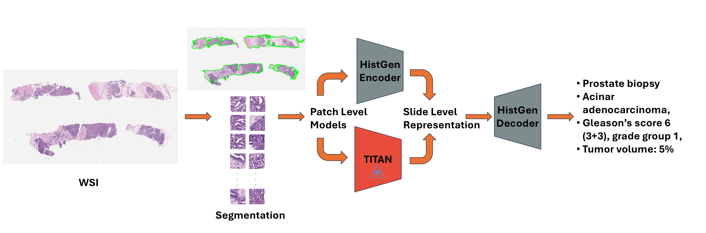
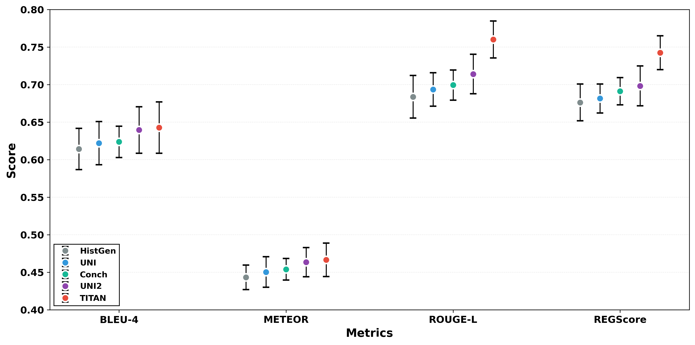
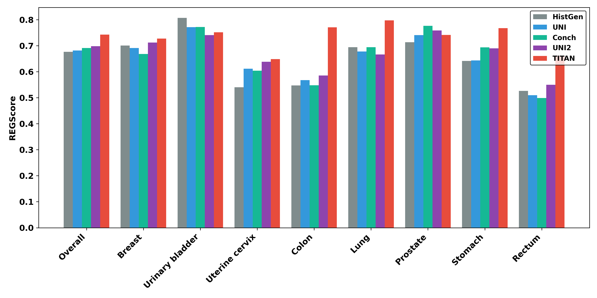

# Slide-Level vs. Patch-Level Encoding for Automated Pathology Report Generation: A Systematic Evaluation

## Aim of the Project
This project presents a systematic evaluation of whether automated report generation benefits more from **learned patch-level aggregation** using enhanced patch-level foundation models, or from **frozen slide-level encoding**, on the REG2025 dataset. We use [HistGen](https://github.com/dddavid4real/HistGen/tree/main) as the baseline — a multiple instance learning (MIL) framework with hierarchical feature aggregation for report generation. We replace its feature extractor with modern patch-level foundation models (UNI, UNI2, CONCH). We then replace HistGen's encoder and cross-modal context module entirely with TITAN, a frozen pretrained slide-level foundation model, training only the decoder. For a detailed flowchart, see [this](assets/detailed_workflow.png).

## Key Contributions
This project systematically compares patch-level and slide-level encoding paradigms for diagnostic report generation in computational pathology. We evaluate five configurations on the REG2025 dataset (8,352 WSI-report pairs spanning seven organ types with standardized CAP protocol reports), using HistGen as the baseline framework.

1. **Slide-level encoding wins**: TITAN (frozen slide-level foundation model) yields statistically significant improvements in ROUGE-L and REG Score over the HistGen baseline and over HistGen pipelines using UNI and CONCH as feature extractors, while also reducing training time by 25%.
2. **The gain isn't just CONCH features**: TITAN's slide embeddings are built on CONCH's patch features, but TITAN still outperforms CONCH directly — isolating the benefit to slide-level encoding itself, not the underlying patch representation.
3. **Scale helps at the patch level too**: Increasing both model capacity and pretraining corpus size (UNI2 vs. UNI) improves patch-level performance, suggesting encoder scaling is beneficial even within the patch-aggregation paradigm.

## Results

*Mean performance of all models across four evaluation metrics. Each point shows the average BLEU-4, METEOR, ROUGE-L, and REG Score on the test set for HistGen (ViT-L), UNI, CONCH, UNI2, and TITAN, with vertical error bars indicating one standard deviation across five runs.*

## Statistical Analysis

### Table 1: Statistical Analysis of all models vs. HistGen Baseline

*Statistical analysis of models against HistGen baseline (differences computed as model − HistGen baseline). The 95% CI reports bootstrap confidence intervals for the difference in REG Score. Asterisks (\*) indicate statistically significant improvements over HistGen. **Bold** values denote large effect sizes (Cohen's d > 0.8) relative to HistGen.*

| Model | BLEU-4 (Mean±SD) | METEOR (Mean±SD) | ROUGE-L (Mean±SD) | REG Score (Mean±SD) | 95% CI (REG Score diff.) |
|-------|------------------|-------------------|---------------------|-----------------------|----------------------------|
| HistGen | 0.614±0.028 | 0.443±0.016 | 0.684±0.028 | 0.676±0.025 | — |
| UNI | 0.622±0.029 | 0.450±0.020 | 0.694±0.022 | 0.682±0.019 | [-0.019, 0.029] |
| CONCH | 0.624±0.020 | 0.454±0.014 | 0.699±0.020 | 0.691±0.018 | [-0.023, 0.041] |
| UNI2 | 0.640±0.031 | 0.464±0.020 | 0.714±0.026 | **0.698±0.027** | [-0.013, 0.055] |
| TITAN | 0.643±0.034 | 0.467±0.022 | **0.760±0.025**\* | **0.742±0.023**\* | [0.029, 0.098] |

### Table 2: Statistical Analysis of Patch-Level Models vs. TITAN

*Statistical analysis of patch-level models against TITAN (differences computed as TITAN − model). The 95% CI column reports bootstrap confidence intervals for the difference in REG Score. Positive intervals therefore indicate that the corresponding patch-level model underperforms TITAN. Asterisks (\*) indicate statistically significant differences from TITAN according to paired t-tests. **Bold** values denote large effect sizes (Cohen's d > 0.8) relative to TITAN.*

| Model | BLEU-4 (Mean±SD) | METEOR (Mean±SD) | ROUGE-L (Mean±SD) | REG Score (Mean±SD) | 95% CI (REG Score diff.) |
|-------|------------------|-------------------|---------------------|-----------------------|----------------------------|
| TITAN | 0.643±0.034 | 0.467±0.022 | 0.760±0.025 | 0.742±0.023 | — |
| UNI | 0.622±0.029 | 0.450±0.020 | **0.694±0.022**\* | **0.682±0.019**\* | [0.048, 0.071] |
| CONCH | 0.624±0.020 | 0.454±0.014 | **0.699±0.020**\* | **0.691±0.018**\* | [0.034, 0.069] |
| UNI2 | 0.640±0.031 | 0.464±0.020 | **0.714±0.026** | **0.698±0.027** | [0.014, 0.070] |

### Anatomical-Level Performance

*Anatomical-level REG Score for all models. Bars show mean REG Score on the test set for HistGen (ViT-L), UNI, CONCH, UNI2, and TITAN, computed overall and separately for each organ. TITAN consistently outperforms other models on the more difficult organs (colon, rectum, lung, stomach), while all models perform similarly on organs with larger, longer-report datasets (breast, prostate).*

## Usage
1. Preprocessing
   
   For segnmentation use [CLAM patching script](/HistGen/CLAM/patching_scripts/tcga-wsi-report.sh) using the [clam](/Conda%20Environments/clam.yml) environment.
   
   For feature extraction using HistGen feature extractor, UNI or UNI2 use the respective [scripts](/HistGen/CLAM/extract_scripts) using [clam](/Conda%20Environments/clam.yml) environment. For CONCH use this [script](/HistGen4TITAN/CONCH%20CLAM/extract_features_calling_script.sh) and post process the features with the postprocessing [script](/HistGen4TITAN/CONCH%20CLAM/PostProcess%20CONCH%20Features/postprocess_featues.ipynb) using [clam_conch](/Conda%20Environments/clam_conch.yml) environment.
   
   To create slide embeddings ftom TITAN use the [TITAN slide embeddings script](/HistGen4TITAN/extractSlideEmbeddings.py) using [histgen_titan](/Conda%20Environments/histgen_titan.yml) environment.

2. Training
   
   To train Histgen baseline and other patch level encoder variants (UNI, UNI2 and CONCH) use the [HistGen training](/HistGen/train_wsi_reportseed4x.sh), [UNI training](/HistGen/train_wsi_report_uni1_seed4x.sh), [UNI2 training](/HistGen/train_wsi_report_uni2_seed4x.sh) and [CONCH training](HistGen/train_wsi_report_conch_histgen_seed42.sh) scripts respectively using the [histgen](/Conda%20Environments/histgen.yml) environment.

   To train TITAN, use [TITAN training](/HistGen4TITAN/train_wsi_report_TITAN.sh) script using [histgen_titan](/Conda%20Environments/histgen_titan.yml) environment.

4. Inference

   For BLUE, METEOR, ROUGE-L, use the [HistGen testing](/HistGen/test_wsi_report_seed4x.sh), [UNI testing](/HistGen/test_wsi_report_UNI1_seed4x.sh), [UNI2 testing](/HistGen/test_wsi_report_UNI2_1_seed4x.sh) and [CONCH testing](/HistGen/test_wsi_report_conch_seed4x.sh) scripts respectively with [histgen](/Conda%20Environments/histgen.yml) environment. For TITAN use [TITAN testing](/HistGen4TITAN/test_wsi_report_5_seed4x.sh) script with [histgen_titan](/Conda%20Environments/histgen_titan.yml) environment.

   For REGScore use the script [HistGen testing](/Other%20Activities/REG2025%20Inference/reg_evaluator.py) with [reg2025-eval](/Conda%20Environments/reg2025-eval.yml) environmet for all the models.

Sample job scripts are present in [Scripts](/job_scripts/)

All the results can be found in [Results](/results/)

